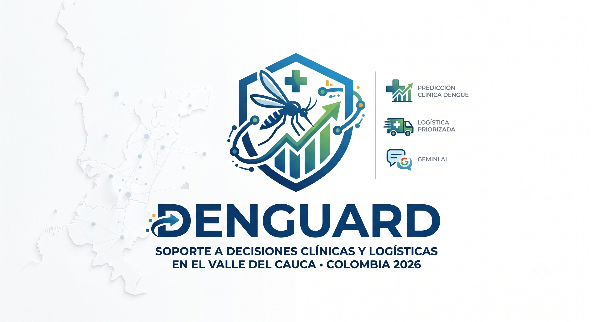

# 🛡️ Denguard: Ecosistema Predictivo de Logística Farmacéutica de Última Milla
## Plataforma de Soporte a Decisiones Clínicas y Logísticas sobre el Ecosistema Colombiano de Datos Abiertos (Valle del Cauca • Colombia • 2026)

  

  
  
  

---

## 📌 1. Visión General y Arquitectura del Sistema

**Denguard** es una plataforma de software de grado de producción diseñada para resolver una de las fallas más críticas en la salud pública colombiana: el desabasto cíclico y reactivo de medicamentos e insumos esenciales durante los brotes de dengue. En lugar de operar bajo un esquema de reabastecimiento puramente empírico o reactivo (reaccionar cuando las urgencias hospitalarias ya están saturadas), Denguard fusiona la **inteligencia epidemiológica cuantitativa** con la **ingeniería de la cadena de suministro de última milla**, automatizando la toma de decisiones críticas para los 42 municipios del Valle del Cauca.

El sistema se fundamenta en un principio rector: **el dato epidemiológico público debe transformarse inmediatamente en una orden de despacho farmacéutico parametrizada**.
